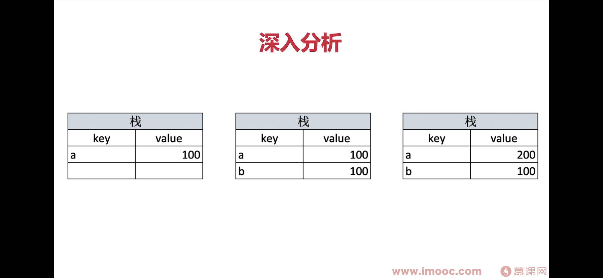
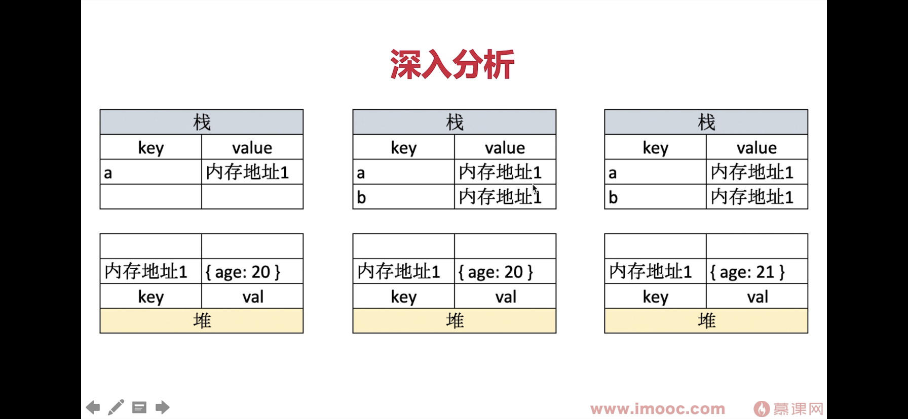

# 变量类型

## 值类型
```javascript
// 值类型
let a = 100
let b = a
a = 200
console.log(b) //100
```
&nbsp;

## 引用类型
```javascript
// 引用类型
let a = { age: 200 }
let b = a
b.age = 21
console.log(a.age) //21
```
&nbsp;

## 深入分析

&nbsp;

&nbsp;

## 常见值类型
```javascript
let a // Undefined const a 必须赋值
const s = 'abc' // String
const n = 100 // Number
const b = true // Bealoon
const s = Symbol('s') // Symbol
```
&nbsp;

## 常见引用类型
```javascript
const obj = { x: 100 } // Object
const arr = ['a', 'b', 'c'] // Object（Array）

const n = null // Null 特殊引用类型，指针指向为空地址
function fn() {} // 特殊引用类型，但不用于存储数据，所以没有拷贝，复制函数这一说
```
&nbsp;

## typeof 运算符
- 识别所有值类型
```javascript
let a // Undefined const a 必须赋值  
const s = 'abc' // String
const n = 100 // Number
const b = true // Bealoon
const s = Symbol('s') // Symbol

typeof a // undefined
```

- 识别函数
```javascript
typeof console.log // function
typeof function fn() {} // function
```

- 判断是不是引用类型（不可再细分）
```javascript
typeof { x: 100 } // Object
typeof ['a', 'b', 'c'] // Object
typeof null // Object
```

## 手写深拷贝
deepClone.js
&nbsp;

# 变量计算 - 类型转化
&nbsp;
## 字符串拼接，+运算符，只有有字符串就不是加法，就是字符串拼接，把非string变成string后拼接
```javascript
const a = 100 + 10  // 110
const b = 100 + '10' // '10010'
const c = true + '10' // 'true10'
const d = 100 + parseInt('10') // 110
```

## ==，
```javascript
100 == '100'  // true
0 == ''  // true
0 == false  // true
false == ''  // true
null == undefined  // true

// 除了 == null 之外，其他都一律用 ===，例如：
const obj = { x: 100 }
if(obj.a == null) { }

// 相当于
if( obj.a === null || obj.a === undefined) 
```

## if语句和逻辑运算符
- truly变量：!!a === true 的变量
除了以下falsely变量，其他都是truly变量
- falsely变量：!!a === false 的变量
0, NaN, '', null, undefined, false

```javascript
const a = true
if(a) {

}
const b = 100
if(b) {

}

const c=""
if(c) {

}

const d=null
if(d) {

}

let e
if(e) {

}
```

# 逻辑判断
```javascript
console.log(10 && 0) // 0
console.log('' || 'abc') // 'abc'
console.log(!window.abc) // true
```

# 面试题
## typeof能判断哪些类型
- 识别所有值类型
```javascript
let a // Undefined const a 必须赋值  
const s = 'abc' // String
const n = 100 // Number
const b = true // Bealoon
const s = Symbol('s') // Symbol

typeof a // undefined
```

- 识别函数
```javascript
typeof console.log // function
typeof function fn() {} // function
```

- 判断是不是引用类型（不可再细分）
```javascript
typeof { x: 100 } // Object
typeof ['a', 'b', 'c'] // Object
typeof null // Object
```

## 何时使用 === 合适使用 ==
```javascript
// 除了 == null 之外，其他都一律用 ===，例如：
const obj = { x: 100 }
if(obj.a == null) { }

// 相当于
if( obj.a === null || obj.a === undefined) 
```

## 值类型和引用类型的区别
```javascript
const obj1 = {x: 100, y:200}
const obj2 = obj1
let x1 = obj1.x
obj2.x = 101
x1 = 102
console.log(obj1) // {x: 101, y: 200}
``` 

## 手写深拷贝
- 注意判断值类型和引用类型
- 注意判断是数组还是对象
- 递归
