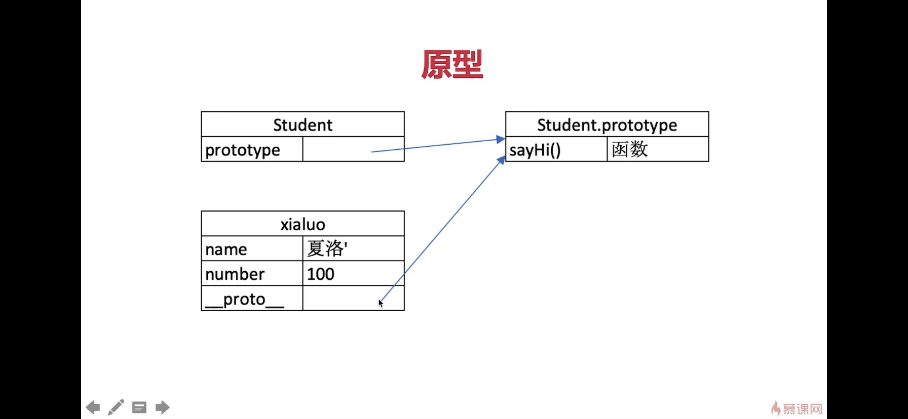
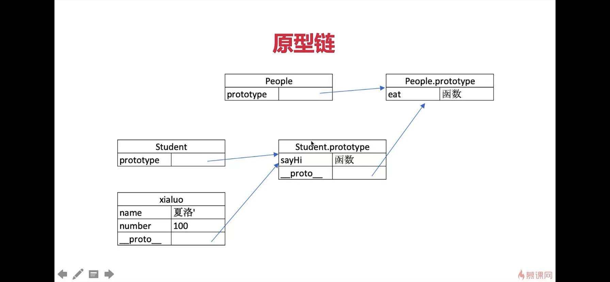
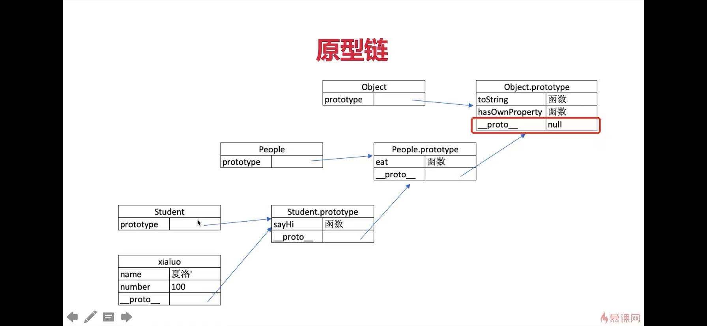

# class
> constructor  
> 属性  
> 方法

&nbsp;
# 继承
> extends  
> super  
> 扩展或重写方法  

&nbsp;

# 原型
```javascript
// class 实际上是函数，可见是语法糖
typeof People // 'function'
typeof Student // 'function'

// 隐式原型和显示原型
console.log( xialuo.__proto__)  // 隐式原型
console.log( Student.prototype)  // 显性原型
console.log( xialuo.__proto__ === Student.prototype )  //true
```


&nbsp;

# 原型关系
> 每个class都有显示原型 portotype   
> 每个实例都有隐式原型 __proto__  
> 实例的 __proto__ 指向对应class的prototype

&nbsp;


# 基于原型的执行规则
> 获取属性 xiaoluo.name 或执行方法 xiaoluo.sayhi() 时  
> 先在自身属性和方法查找  
> 如果找不到则自动去 __proto__ 中查找  

&nbsp;

# 原型链
```javascript
console.log(Student.prototype.__proto__)
console.log(People.prototype)
console.log(People.prototype === Student.prototype.__proto__)
```



&nbsp;

# 类型判断 instanceof
左边的可以顺着原型链找到右边的，就是true
```javascript
xialuo instanceof Student  // true
xialuo instanceof People  // true
xialuo instanceof Object  // true

[] instanceof Array  // true
[] instanceof Object  // true

{} instanceof Object  // true
```
&nbsp;

# hasOwnProperty() 是否是自己的属性和方法
```javascript
xialuo.hasOwnProperty('name') // true
xialuo.hasOwnProperty('sayHi') // false
xialuo.hasOwnProperty('eat') // false
xialuo.hasOwnProperty('hasOwnProperty') // false

xialuo.__proto__ === Student.prototype //true
Student.prototype.hasOwnProperty('sayHi') //true
xialuo.__proto__.hasOwnProperty('sayHi') //true
```

# 题目
## 1.如何准确判断一个变量是不是数组？
a instanceof Array

&nbsp;

## 2.手写一个简易的jQuery，考虑插件和扩展性
&nbsp;


## 3.class的原型本质，怎么理解
原型和原型链的图示  
属性和方法的执行规则，就是顺着原型链找到可以属性和方法  

&nbsp;

# 补充
## 对象的迭代
```javascript
let p = {
    1: 1, 
    first: 'first', 
    [Symbol('k')]: 'sym2', 
    second: 'second', 
    0: 0 
}

console.log(Object.keys(p));
// ["0", "1", "first", "second"]

for(let k of Object.keys(p))
{
    console.log(k);
}
/*
0
1
first
second
*/
console.log(Object.values(p));
// [0, 1, "first", "second"]
console.log(Object.entries(p));
// [["0", 0],["1", 1],["first", "first"],["second", "second"]]

for(let k in p)
{
    console.log(k);
}
/*
0
1
first
second
*/

console.log(Object.getOwnPropertyNames(p));
// ["0", "1", "first", "second"]
console.log(Object.getOwnPropertySymbols(p));
// [Symbol(k)]
console.log(Object.assign(p));
// {0: 0, 1: 1, first: "first", second: "second", Symbol(k): "sym2"}

```

## new333
```javascript
function Person (name, ...age){
    console.log(`new?${true}`)
    this.name=name;
    this.age=age;
}

Person.prototype.getName = function(){
    return this.name;
}

let p = new Person();
console.log(p);

function _new(Parent, args){
    console.log(args);
    // 创建一个空对象
    let c = {};

    // 将空对象的原型指向构造函数的原型
    c.__proto__ = Parent.prototype;

    // 执行构造函数
    // 将构造函数的作用域赋给新对象
    // 就是把this指向新对象
    // 传入参数
    let pr = Parent.apply(c, args);

    // 返回对象或者构造函数返回值
    if(typeof pr === "object") return pr;
    else return c;

}

let p2 = _new(Person, ['Parrot', 18]);
console.log(p2);


```


