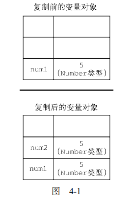
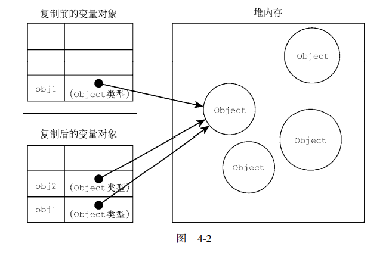

# Javascript
[语言基础](#语言基础)  
- [数据类型](#数据类型)  
- [操作符](#操作符)  
- [语句](#语句)  

[变量、作用域与内存](#变量作用域与内存)  

[基本引用类型](#基本引用类型)  

[集合引用类型](#集合引用类型)  


# 语言基础

## 数据类型
[TOP](#Javascript)

ECMAScript数据类型：  
6种 简单数据类型：Undefined，Null，Symbol，Number，String，Boolean  
1种 复杂数据类型：Object

typeof 返回值  
undefined  
symbol  
function  
number  
string  
boolean  
object  

```javascript
let message = "some string";
console.log(typeof message); // string
console.log(typeof null); // object
```

### 1，Undefined 类型
Undefined 类型只有一个值：undefined  
当使用var或者let声明变量但是没有初始化时，就相当给变量赋值undefined  
```javascript
let message;
console.log(message === undefined); // true
```
一般不给某个变量赋值undefined  

```javascript
let message;
// let age

console.log(typeof message);  // undefined
console.log(typeof age); // undefined
```

### 2，Null 类型
Null类型只有一个值：null  
null值表示一个空对象指针  
```javascript
let message = "some string";
console.log(typeof null); // object
```
声明一个对象，没有初始值，可以给对象赋值null  

### 3，Boolean类型

Boolean类型有两个值：true false  
Boolean() 将其他类型的值转化为Boolean  
```javascript
let message = "m";
let mb = Boolean(message);
console.log(mb);  // ture
```

String  
非空字符串 -> true  
空字符串 -> false

Number  
非零数字 -> true  
0, NaN-> false

Object  
任意对象 -> true  
null -> false  

Undefined  
undefined -> false  

### 4，Number 类型
整数 浮点数，浮点数的存储空间是整数的2倍

```javascript
// 十进制
let intNum = 35;

// 八进制 第一个数字必须是0，如果超出数字范围，会忽略前导零，把后面的数字当作十进制处理，八进制在严格模式下无效
let num1 = 070;  // 八进制的56
let num2 = 079;  // 无效八进制，当成79处理
let num3 = 08;  // 无效八进制，当成8处理

// 十六进制 Ox开头，十六进制中大小写均可
let num4 = OxA;  // 十六进制的10
let num5 = Ox1F; // 十六进制的31

// 八进制和十六进制格式创建的数字在所有数学操作中都被视为十进制
```

浮点数：数值中必须包含小数点，小数点后面至少有一个数字，小数点前面可以没有数字，但不推荐
```javascript
let floatNum1 = 1.1;
let floatNum2 = 0.1;
let floatNum3 = .1; // 有效，不推荐
```

```javascript
let floatNum1 = 1.; // 小数点后面没有数字，当成整数1处理
let floatNum1 = 10.0; // 小数点后面是0，当成整数10处理
```

非常大或者非常小的数值用科学计数法
```javascript
let floatNum1 = 3.125e7; // 31250000
let floatNum1 = 3e-7; // 0.0000003
```

```javascript
0.1+0.2 = 0.30000000000000004
```

可以表示的最大值：Number.MAX_VALUE  
可以表示的最小值：Number.MIN_VALUE  
如果超出范围，数值会转化成Infinity（无穷）值  
负无穷大-Infinity  
正无穷大 Infinity  
如果返回Infinity或者-Infinity，这个值都不能再进一步计算  
isFinity() 值是否有限大   

```javascript
let res = Number.MAX_VALUE + 1;
console.log(isFinite(res)); // ture
```

NaN 不是数值，not a number  
表示本来要返回数值的操作失败了  

```javascript
// 0,+0,-0 相除返回NaN
console.log(0/0);  // NaN
console.log(-0/+0);  // NaN

// 分子非0，分母是0，+0，-0 返回Infinity，Infinity，-Infinity
console.log(5/0);  // Infinity
console.log(5/+0);  // Infinity
console.log(5/-0);  // -Infinity

console.log(0/1);  // 0
```
isNaN() 返回是否“不是数值”，不是Number类型，先用Number()类型转化
```javascript
console.log(isNaN(NaN))  // ture
console.log(isNaN(10))  // false
console.log(isNaN("10"))  // false 转化为数值10
console.log(isNaN("blue"))  // ture
console.log(isNaN(true))  // false 转化为1
console.log(isNaN("77blue"))  // ture
```
NaN的属性  
1，任何涉及NaN的操作始终返回NaN，例如NaN/10  
2，NaN不等于包含NaN在内的任何值  
NaN == NaN   false  

Number()  任意数据类型转化为数值  
Boolean：true -> 1,  false -> 0  
Number: 直接返回  
null：0  
undefined：NaN  
String：   
1，数值（前面可以带有+-，忽略前面的0）-> 十进制数  
2，浮点 -> 浮点数  
3，十六进制 -> 十六进制对应的十进制  
4，空字符串 -> 0  
5，以上4种以外 -> NaN  
Object：调用valueOf()方法，按照上述规则转化valueOf()的返回值，如果转化结果是NaN，再调用toString()，按照String规则转化toString()的返回值  

parseInt() 字符串转化为数值  
从第一个非空格字符开始转化，字符串开头的空格会被忽略   
如果第一个字符不是数值字符，+，- ：直接返回NaN  
如果第一个字符是数值字符，+，- ：继续检测每个字符，知道字符串结尾或者碰到非数值字符  
如果字符串 “0x”开头，会被解释称十六进制，“0”开头且紧跟着数值，在非严格模式下解释成八进制  

```javascript
parseInt("1234blue");  // 1234
parseInt(""); // NaN
parseInt("0xA"); // 10
parseInt("22.5"); // 22
parseInt("70"); // 70
parseInt("0xf"); // 15
```

parseInt() 第二个参数，指定进制数  
```javascript
parseInt("0xaf", 16); // 175
parseInt("af", 16); // 175, 指定16，0x可以省略
parseInt("af");// NaN，不指定16，0x不能省略

parseInt("10", 2); // 2
parseInt("10", 8); // 8
parseInt("10", 10); // 10
parseInt("10", 16); // 16
```

parseFloat() 工作方式同parseInt()  
.只识别第一个，第二个.会停止  
只解析十进制  
如果字符串没有小数点或者小数点后面是0，返回整数

```javascript
parseFloat("1234blue");  // 1234
parseFloat("0xA");  // 0
parseFloat("22.5"); // 22.5
parseFloat("22.34.5");  // 22.34
parseFloat("0908.5");  // 908.5
parseFloat("3.125e7");  // 31250000
```

### 5.String 类型
0或多个16位Unicode字符序列  
"",'',``  解释无区别  
length属性，字符串长度 
```javascript
let text = "a \u03a3 \x41";
console.log(text); // a Σ A

console.log(text.length) // 5
``` 
字符串一旦创建，值不能变，修改变量中字符串的值，先销毁原来的字符串，将另一个字符串保存到这个变量  

toString()  
Number，Boolean，Object，String -> String 转为为当前值的字符串等价物   
Null和Undefined没有toString()  
```javascript
let age = 11;
let found = true;
console.log(age.toString());  // "11"
console.log(found.toString()); // "true"

// Number调用toString()可以加参数指定进制
let num = 10;
console.log(num.toString()); // "10"
console.log(num.toString(2)); // "1010"
console.log(num.toString(8)); // "12"
console.log(num.toString(10)); // "10"
console.log(num.toString(16)); // "a"
``` 

String()  
如果值有toString()，调用toString()  
如果值是null或者undefined，返回"null"或者"undefined"  

模板字面量 
```javascript 
let thirdTemplateLiteral = `first line 
second line`; 
console.log(thirdTemplateLiteral); 
/*
first line 
second line
*/
``` 

模板字面量字符串插值  ${js表达式}  
所有插入的值都会使用 String()强制转型为字符串，而且任何 JavaScript 表达式都可以用于插
值，包括函数和方法。
```javascript
let value = 5; 
let exponent = 'second'; 
let interpolatedTemplateLiteral = 
 `${ value } to the ${ exponent } power is ${ value * value }`; 
console.log(interpolatedString); // 5 to the second power is 25
```

模板字面量标签函数？

### 6.Symbol 类型
是唯一、不可变的  
Symbol()函数初始化，也可以传入一个字符串参数作为对符号的描述（description），将来可以通
过这个字符串来调试代码。但是，这个字符串参数与符号定义或标识完全无关：

```javascript
let sym = Symbol(); 
console.log(typeof sym); // symbol 

let genericSymbol = Symbol(); 
let otherGenericSymbol = Symbol(); 
let fooSymbol = Symbol('foo'); 
let otherFooSymbol = Symbol('foo'); 
console.log(genericSymbol == otherGenericSymbol); // false 
console.log(fooSymbol == otherFooSymbol); // false 
```

Symbol()函数不能与 new 关键字一起作为构造函数使用
```javascript
let myBoolean = new Boolean(); 
console.log(typeof myBoolean); // "object" 
let myString = new String(); 
console.log(typeof myString); // "object" 
let myNumber = new Number(); 
console.log(typeof myNumber); // "object" 
let mySymbol = new Symbol(); // TypeError: Symbol is not a constructor 

let mySymbol = Symbol(); 
let myWrappedSymbol = Object(mySymbol); 
console.log(typeof myWrappedSymbol); // "object"
```

Symbol.for()用一个字符串为键，在全局符号注册表定义符号，可以重用  

```javascript
let fooGlobalSymbol = Symbol.for('foo'); // 创建新符号
let otherFooGlobalSymbol = Symbol.for('foo'); // 重用已有符号
console.log(fooGlobalSymbol === otherFooGlobalSymbol); // true 
```

用相同描述在全局注册表定义和Symbol()定义不用
```javascript
let localSymbol = Symbol('foo'); 
let globalSymbol = Symbol.for('foo'); 
console.log(localSymbol === globalSymbol); // false 

console.log(localSymbol);  // Symbol(foo)
console.log(globalSymbol); // Symbol(foo)

let localSymbol2 = Symbol(); 
let globalSymbol2 = Symbol.for();

console.log(localSymbol2); // Symbol()
console.log(globalSymbol2); // Symbol(undefined)

```

Symbol.keyFor() 查询全局注册表  
这个方法接收符号，返回该全局符号对应的字
符串键。如果查询的不是全局符号，则返回 undefined。

```javascript
let symbol1 = Symbol.for('foo');
console.log(Symbol.keyFor(symbol1)); // foo

let symbol2 = Symbol('foo');
console.log(Symbol.keyFor(symbol2)); // undefined
```

如果传给 Symbol.keyFor()的不是符号，则该方法抛出 TypeError：
```javascript
Symbol.keyFor(123); // TypeError: 123 is not a symbol 
```

使用符号作为属性
```javascript
let s1=Symbol('s1'),
    s2=Symbol('s2'),
    s3=Symbol('s3'),
    s4=Symbol('s4');

let o = {
    [s1]: "o1",
}
console.log(o);

Object.defineProperty(o, s2, {value: 's2'});

Object.defineProperties(o, 
{
    [s3]: {value: 'o3'},
    [s4]: {value: 'o4'}
});

console.log(o);

/*
{Symbol(s1): "o1", Symbol(s2): "s2", Symbol(s3): "o3", Symbol(s4): "o4"}
*/
```


### 7.Object 类型
let o = new Object(); 
let o = new Object;  // 合法，但不推荐

每个 Object 实例都有如下属性和方法。 
1，constructor：用于创建当前对象的函数。在前面的例子中，这个属性的值就是 Object() 
函数。 
2，hasOwnProperty(propertyName)：用于判断当前对象实例（不是原型）上是否存在给定的属
性。要检查的属性名必须是字符串（如 o.hasOwnProperty("name")）或符号。
3，isPrototypeOf(object)：用于判断当前对象是否为另一个对象的原型。（第 8 章将详细介绍
原型。）
4，propertyIsEnumerable(propertyName)：用于判断给定的属性是否可以使用（本章稍后讨
论的）for-in 语句枚举。与 hasOwnProperty()一样，属性名必须是字符串。
5，toLocaleString()：返回对象的字符串表示，该字符串反映对象所在的本地化执行环境。
6，toString()：返回对象的字符串表示。
7，valueOf()：返回对象对应的字符串、数值或布尔值表示。通常与 toString()的返回值相同


## 操作符
[TOP](#Javascript)

++i  --i  表达式中先计算，在放在表达式中求值  
i++  i--  表达式中先求值，再计算

```javascript
//区别
let num1 = 2; 
let num2 = 20; 
let num3 = --num1 + num2;  // 21
let num4 = num1 + num2;  // 21

let num1 = 2; 
let num2 = 20; 
let num3 = num1-- + num2;  // 22
let num4 = num1 + num2;  // 21
```

++和-- 可以用于任意类型变量，不是Number先Number()，再做++或--  
```javascript
let s1 = "2"; 
let s2 = "z"; 
let b = false; 
let f = 1.1; 
let o = { 
 valueOf() { 
 return -1; 
 } 
}; 
s1++; // 值变成数值 3 
s2++; // 值变成 NaN 
b++; // 值变成数值 1 
f--; // 值变成 0.10000000000000009（因为浮点数不精确）
o--; // 值变成-2 
```

### 布尔操作符
!  
先Boolean()再判断  
!! 相当调用了Boolean()

&&  
会从左到右执行表达式，直到某个表达式的运行结果返回false，或者可以转化为false，则返回该表达式的运行结果作为整个&&表达式的运行结果；如果所有表达式的直接结果均为true，则返回最后一个表达式的执行结果作为整个&&表达式的结果  

|| 
会从左到右执行表达式，直到某个表达式的运行结果返回true，或者可以转化为true，则返回该表达式的运行结果作为整个||表达式的运行结果；如果所有表达式的直接结果均为false，则返回最后一个表达式的执行结果作为整个||表达式的结果  

&& || 短路操作，如果第一个操作数决定了结果，不会对第二个操作数求值  

### 乘性操作符
\* / % ** 不是Number，先Number()  
\*  
> 乘法结果不能表示，返回+-Infinity  
> 有NaN，返回NaN  
> Infinity乘以任何数，返回+-Infinity 

/  
> 除法结果不能表示，返回+-Infinity  
> 有NaN，返回NaN    
> Infinity除以任何数，返回+-Infinity  
> 0除以0，返回NaN  
> 非0有限值除以0，返回+-Infinity

%  取模，余数  
> Infinity % 任何数 = NaN  
> 有限值 % 0 = NaN   
> 有限值 % Infinity = 被除数  
> 0 % 非零数 = 0  

** Math.pow() **=  

### 加性操作符
\+ -  
+
如果有一个操作数是字符串，则要应用如下规则：  
1,如果两个操作数都是字符串，则将第二个字符串拼接到第一个字符串后面  
2,如果只有一个操作数是字符串，则将另一个操作数转换为字符串，再将两个字符串拼接在一起。
```javascript
let result1 = 5 + 5; // 两个数值
console.log(result1); // 10 
let result2 = 5 + "5"; // 一个数值和一个字符串
console.log(result2); // "55"

// 每个+都是独立完成
let num1 = 5; 
let num2 = 10; 
// ，第一个加是字符串+数字，然后又是字符串+数字
let message = "The sum of 5 and 10 is " + num1 + num2; 
console.log(message); // "The sum of 5 and 10 is 510"

let num1 = 5; 
let num2 = 10; 
let message = "The sum of 5 and 10 is " + (num1 + num2); 
console.log(message); // "The sum of 5 and 10 is 15" 
```

\- 不是Number，Number()转化后计算

### 关系操作符
小于（<）、大于（>）、小于等于（<=）和大于等于（>=），返回Boolean  
1，操作数都是字符串，逐个比较字符串中对应的编码，大写字母 < 小写字母    
2，其他情况Number()后比较，如果有NaN，都返回false  

```javascript
let result = "Brick" < "alphabet"; // true
let result = "23" < "3"; // true  
let result = "23" < 3; // false
let result = "a" < 3; // 因为"a"会转换为 NaN，所以结果是 false 
```

### 相等操作符
等于和不等于 ==，!=  

非null，undefined，object  
1，操作数都是字符串，逐个比较字符串中对应的编码，大写字母 < 小写字母    
2，其他情况Number()后比较，如果有NaN，相等操作符返回 false，不相等操作符返回 true  

null和undefined  
1，null 和 undefined 相等  
2，null 和 undefined 不能转换为其他类型的值再进行比较  

object  
如果两个操作数都是对象，则比较它们是不是同一个对象。如果两个操作数都指向同一个对象，
则相等操作符返回 true。否则，两者不相等。  

全等和不全等 ===  !==  
不进行类型转化   


###  条件操作符
?:

### 赋值操作符  
=  

### 逗号操作符
```javascript
let num1 = 1, num2 = 2, num3 = 3; 
// 在赋值时使用逗号操作符分隔值，最终会返回表达式中最后一个值
let num = (5, 1, 4, 8, 0); // num 的值为 0 
```

## 语句
[TOP](#Javascript)

if  
else if  
else  

do-while  
```javascript
let i=0;
do {
    i += 2;
} while (i < 10);
```

while  
```javascript
let i=0;
while (i < 10){
    i += 2;
}
```

for  
```javascript
let count=0;
for (let i=0; i< count; i++)
{
    console.log(i);
}
```

for-in  
枚举对象中的非符号键属性  
```javascript
let o = {
    a: 3,
    b: 9,
    c: 7
}
for (let i in o)
{
    console.log(i);
}
```

for-of  
遍历可迭代对象的元素，for-of 循环会按照可迭代对象的 next()方法产生值的顺序迭代元素     
```javascript
for (let v of [2,4,6,8])
{
    console.log(v);
}
```

标签语句
```javascript
start: for (let i = 0; i < count; i++) { 
 console.log(i); 
}
```

break 和 continue 语句  
```javascript
let num = 0; 
outermost: 
for (let i = 0; i < 10; i++) { 
    for (let j = 0; j < 10; j++) { 
        if (i == 5 && j == 5) { 
            break outermost;  // break 不仅跳出内部循环，也跳出了外部循环
        } 
        num++; 
    } 
} 
console.log(num); // 55
```

```javascript
let num = 0; 
outermost: 
for (let i = 0; i < 10; i++) { 
    for (let j = 0; j < 10; j++) { 
        if (i == 5 && j == 5) { 
            continue outermost; 
        } 
        num++; 
    } 
} 
console.log(num);
```

switch  
```javascript
let i=25;
switch(i){
    case 5:
    case 15:
    console.log("5 or 15");
    break;

    case 25:
    console.log(25);
    break;

    case 35:
    console.log(35);
    break;

    default:
    console.log("other");
}
```


# 变量、作用域与内存
[TOP](#Javascript)

## 原始值与引用值  
原始值（primitive value）：Undefined、Null、Boolean、Number、String 和 Symbol  
引用值（reference value）：Object  

### 动态属性只有引用类型有
```javascript
let person = new Object(); 
person.name = "Nicholas"; 
console.log(person.name); // "Nicholas" 

let name = "Nicholas"; 
name.age = 27; 
console.log(name.age); // undefined

let name1 = "Nicholas"; 
let name2 = new String("Matt"); 
name1.age = 27; 
name2.age = 26; 
console.log(name1.age); // undefined 
console.log(name2.age); // 26 
console.log(typeof name1); // string 
console.log(typeof name2); // object 
```

### 复制值  

```javascript
let num1 = 5; 
let num2 = num1; 
```


```javascript
let obj1 = new Object(); 
let obj2 = obj1; 
obj1.name = "Nicholas"; 
console.log(obj2.name); // "Nicholas" 
```


### 传递参数  
ECMAScript 中所有函数的参数都是按值传递的  

```javascript
function addTen(num) { 
 num += 10; 
 return num; 
} 
let count = 20; 
let result = addTen(count); 
console.log(count); // 20，没有变化
console.log(result); // 30 

function setName(obj) { 
 obj.name = "Nicholas"; 
} 
let person = new Object(); 
setName(person); 
console.log(person.name); // "Nicholas" 

function setName(obj) { 
 obj.name = "Nicholas"; 
 obj = new Object(); 
 obj.name = "Greg"; 
} 
let person = new Object(); 
setName(person); 
console.log(person.name); // "Nicholas"
```

### instanceof
如果变量是给定引用类型（由其原型链决定）的实例，则 instanceof 操作符返回 true。
```javascript
console.log(person instanceof Object);
```

## 执行上下文与作用域

全局上下文就是我们常说的 window 对象，通过 var 定义的全局变量和函数都会成为 window 对象的属性和方法。使用 let 和 const 的顶级声明不会定义在全局上下文中，但在作用域链解析上效果是一样的。  

上下文在其所有代码都执行完毕后会被销毁，包括定义在它上面的所有变量和函数（全局上下文在应用程序退出前才会被销毁，比如关闭网页或退出浏览器）。  

上下文中的代码在执行的时候，会创建变量对象的一个作用域链（scope chain）。  

内部上下文可以通过作用域链访问外部上下文中的一切，但外部上下文无法访问内部上下文中的任何东西。逐级向外搜索。

## 变量声明

### var变量提升 

var 声明会被拿到函数或全局作用域的顶部，位于作用域中所有代码之前。 

```javascript
var name = "Jake"; 
// 等价于：
name = 'Jake'; 
var name; 

function fn1() { 
 var name = 'Jake'; 
} 
// 等价于：
function fn2() { 
 var name; 
 name = 'Jake'; 
} 

// 通过在声明之前打印变量，可以验证变量会被提升。声明的提升意味着会输出 undefined 而不是Reference Error：
console.log(name); // undefined 
var name = 'Jake'; 

function() { 
 console.log(name); // undefined 
 var name = 'Jake'; 
}
```


### 使用 let 的块级作用域声明

let 块级作用域声明，出了块无效
```javascript
if (true) { 
 let a; 
} 
console.log(a); // ReferenceError: a 没有定义

while (true) { 
 let b; 
} 
console.log(b); // ReferenceError: b 没有定义

function foo() { 
 let c; 
} 
console.log(c); // ReferenceError: c 没有定义

{ 
 let d; 
} 
console.log(d); // ReferenceError: d 没有定义
```

let 在同一作用域内不能声明两次，复的 let 声明会抛出 SyntaxError  
var 在同一作用域内可以声明两次。

```javascript
var a; 
var a; 
// 不会报错

{ 
 let b; 
 let b; 
} 
// SyntaxError: 标识符 b 已经声明过了
```

```javascript
for (var i = 0; i < 10; ++i) {} 
console.log(i); // 10 
for (let j = 0; j < 10; ++j) {} 
console.log(j); // ReferenceError: j 没有定义
```

暂时性死区
在用let声明变量之前的位置，是暂时性死区  

### const 常量
const 声明的变量必须同时初始化为某个值。一经声明，在其生命周期的任何时候都不能再重新赋予新值。
```javascript
const a; // SyntaxError: 常量声明时没有初始化
const b = 3; 
console.log(b); // 3 
b = 4; // TypeError: 给常量赋值
```

const除了声明时要赋值，其他跟let规则一样   

```javascript
const o1 = {}; 
o1 = {}; // TypeError: 给常量赋值

// 常量对象里可以定义新的属性和方法
const o2 = {}; 
o2.name = 'Jake'; 
console.log(o2.name); // 'Jake'

// 对象不能被修改，用Object.freeze()
const o3 = Object.freeze({}); 
o3.name = 'Jake'; 
console.log(o3.name); // undefined
```

## 垃圾回收
JavaScript 是使用垃圾回收的编程语言，开发者不需要操心内存分配和回收

### 标记清理 常用 
离开作用域的值会被自动标记为可回收，然后在垃圾回收期间被删除。

### 引用计数

### 内存管理 提高性能
1，解除引用：如果数据不再必要，那么把它设置为 null，从而释放其引用。这个建议最适合全局变量和全局对象的属性
```javascript
function createPerson(name){ 
 let localPerson = new Object(); 
 localPerson.name = name; 
 return localPerson; 
} 
let globalPerson = createPerson("Nicholas"); 
// 解除 globalPerson 对值的引用
globalPerson = null;
```

2，通过 const 和 let 声明提升性能   

3，构造函数中一次性声明所有属性，创建不同的对象，共用同一个“隐藏类”，如果某个对象的属性不想用了，可以设置为null，而不delete

4，内存泄漏  
```javascript
//解释器会把变量 name 当作 window 的属性来创建（相当于 window.name = 'Jake'）。在 window 对象上创建的属性，只要 window 本身不被清理就不会消失。在变量声明前头加上 var、let 或 const 关键字
function setName() { 
 name = 'Jake'; 
} 
```

```javascript
// 定时器内存泄漏。定时器的回调通过闭包引用了外部变量
let name = 'Jake'; 
setInterval(() => { 
 console.log(name); 
}, 100); 
```

```javascript
// 闭包很容易在不知不觉间造成内存泄漏。
let outer = function() { 
 let name = 'Jake'; 
 return function() { 
 return name; 
 }; 
}; 
```

# 基本引用类型
[TOP](#Javascript)

## Date
```javascript
// 返回当前日期时间
let now = new Date();
// 要基于其他日期和时间创建日期对象，必须传入其毫秒表示
```
Date.parse()   
参数：表示日期的字符串  
返回值：该日期的毫秒数，如果传入字符串不表示日期，返回NaN。  
格式  
- “月/日/年”，如"5/23/2019"；
- “月名 日, 年”，如"May 23, 2019"；
- “周几 月名 日 年 时:分:秒 时区”，如"Tue May 23 2019 00:00:00 GMT-0700"；
- ISO 8601 扩展格式“YYYY-MM-DDTHH:mm:ss.sssZ”，如 2019-05-23T00:00:00（只适用于
兼容 ES5 的实现）。

```javascript
let someDate = new Date(Date.parse("May 23, 2019")); // 1558540800000
```

Date.UTC()   
参数：年、零起点月数（1 月是 0，2 月是 1）、日（1~31）、时（0~23）、分、秒和毫秒，年和月是必需，其他默认最小值。  
返回值：该日期的毫秒数，失败返回NaN。  

```javascript
let d1 = new Date(Date.UTC(2002, 6));
let d1 = new Date(Date.UTC(2002, 6, 8, 16, 18, 43));
```

Date.parse()  Date.UTC() 被 Date隐式调用
```javascript
let date1 = new Date(2000,0);
let date2 = new Date(5/23/2002);
```

Date.now()  
返回表示方法执行时日期和时间的毫秒数  

```javascript
getTime() //毫秒数
setTime()
getFullYear() //2020
setFullYear()
getMonth()  // 0表示1月
setMonth()
getDate() // 0-31
setDate()
getDay() // 0周日
getHours() //0-23
setHours()
getMinutes() //0-59
setMinutes()
getSeconds() //0-59
setSeconds()
getMilliseconds() //毫秒
setMilliseconds()
```

## RegExp

## 原始值包装类型

## Boolean
## Number
toFixed()  
返回包含指定小数点位数的数值字符串，四舍五入  
```javascript
let num = 10.323;
let num1 = num.toFixed(2); // "10.32"
parseFloat(num1); // 10.32
```

isInteger()  
数值是否为整数  
```javascript
console.log(Number.isInteger(1)); // true 
console.log(Number.isInteger(1.00)); // true 
console.log(Number.isInteger(1.01)); // false 
```

## String  
charAt() 返回给定位置字符串，0开始 
```javascript
let m="abcde";
s2=m.charAt(2);
console.log(s2);
```

concat() 字符串连接
```javascript
let s1 = "hello ";
let s2 = s1.concat('world');

// s1: hello
// s2: hello world

let s3 = s1.concat('new ', 'world ', '!');
console.log(s3);
```

slice()  
第一个参数，字符串开始的位置，0开始  
第二个参数，字符串结束的位置，当前位置不包含，第二个参数省略，提取到结尾 
如果第二个参数小于第一个参数，返回空字符串   
substr()  
第一个参数，字符串开始的位置，0开始  
第二个参数，返回的字符数，第二个参数省略，提取到结尾  
substring()  
第一个参数，字符串开始的位置，0开始  
第二个参数，字符串结束的位置，当前位置不包含，第二个参数省略，提取到结尾  
如果第二个参数小于第一个参数，两个参数调换位置

```javascript
let stringValue = "hello world"; 
console.log(stringValue.slice(3));  
// lo world

console.log(stringValue.substring(3)); 
// lo world 

console.log(stringValue.substr(3)); 
// lo world

console.log(stringValue.slice(3, 7));
// lo w
console.log(stringValue.substring(3,7));
// lo w
console.log(stringValue.substr(3, 7));
// lo worl
``` 

当有参数是负值时  
slice() 所有负值参数+字符串长度  
substr() 第一个负值参数+字符串长度，第二个负值参数转化为0  
substring() 所有负值参数转化为0  

```javascript
let stringValue = "hello world"; 
console.log(stringValue.slice(-3));
// rld

console.log(stringValue.substring(-3)); 
// hello world

console.log(stringValue.substr(-3));
// rld

console.log(stringValue.slice(3, -4)); 
// lo w

console.log(stringValue.substring(3, -4));
// "hel"

console.log(stringValue.substr(3, -4)); 
// ""

```

indexOf()  
搜索传入字符串，从开头找，返回位置，找不到返回-1  
lastIndexOf()  
搜索传入字符串，从结尾找，返回位置，返回的位置值都是从开头计算的值，找不到返回-1  

```javascript
let stringValue = "hello world"; 
console.log(stringValue.indexOf("o")); //4
console.log(stringValue.lastIndexOf("o")); //7
```

第二个参数从这个位置开始向后，或者向前查找  
```javascript
let stringValue = "hello world"; 
console.log(stringValue.indexOf("o", 6)); //7 
console.log(stringValue.lastIndexOf("o", 6)); //4
```

```javascript
let stringValue = "Lorem ipsum dolor sit amet, consectetur adipisicing elit"; 
let positions = new Array(); 
let pos = stringValue.indexOf("e"); 
while(pos > -1) { 
 positions.push(pos); 
 pos = stringValue.indexOf("e", pos + 1); 
} 
console.log(positions); // [3,24,32,35,52] 
```

trim()，trimLeft(), trimRight()  
清除空格  
```javascript
let s1 = " hello world "; 
let s2 = s1.trim();
console.log(s1); //  hello world 
console.log(s2); // hello world
```

startsWith()  
是否以字符串开头  
第二个参数，指定开始位置  
endsWith()  
是否以字符串结尾  
第二个参数，指定字符串长度    
includes()  
是否包含字符串  
第二个参数，指定开始位置    

```javascript
let message = "foobarbaz"; 
console.log(message.startsWith("foo")); // true 
console.log(message.startsWith("bar")); // false 
console.log(message.endsWith("baz")); // true 
console.log(message.endsWith("bar")); // false 
console.log(message.includes("bar")); // true 
console.log(message.includes("qux")); // false

console.log(message.startsWith("foo")); // true 
console.log(message.startsWith("foo", 1)); // false 
console.log(message.includes("bar")); // true 
console.log(message.includes("bar", 4)); // false 
console.log(message.endsWith("bar")); // false 
console.log(message.endsWith("bar", 6)); // true
```

repeat()    
复制字符串，参数复制n-1次，返回源字符串和复制字符串的拼接   
```javascript
let s1 = "na ";
let s2 = s1.repeat(3);
console.log(s2); // na na na 
```

padStart()，padEnd()  
第一个参数：字符串填充后的长度   
第二个参数：要填充的字符串，默认是空格，第二个参数可以是多个字符  

```javascript
let stringValue = "foo"; 
console.log(stringValue.padStart(6));  //   foo
console.log(stringValue.padStart(9, ".")); //......foo
console.log(stringValue.padEnd(6)); //foo   
console.log(stringValue.padEnd(9, ".")); //foo......
```
```javascript
let stringValue = "foo"; 
console.log(stringValue.padStart(8, "bar")); //barbafoo
console.log(stringValue.padStart(2)); //foo
console.log(stringValue.padEnd(8, "bar")); //foobarba
console.log(stringValue.padEnd(2)); //foo
```

迭代和解构  
```javascript
let s1 = "abcde";
let s1Iterator = s1[Symbol.iterator]();

s1Iterator.next() // {value: "a", done: false}
s1Iterator.next() // {value: "a", done: false}
s1Iterator.next() // {value: "c", done: false}
s1Iterator.next() // {value: "d", done: false}
s1Iterator.next() // {value: "e", done: false}
s1Iterator.next() // {value: undefined, done: ture}

for (let c of s1)
{
    console.log(c);
}
/*
a
b
c
d
e
*/

let s3 = [...s1]; 
console.log(s3);
// ["a", "b", "c", "d", "e"]
```

toLowerCase()  
toUpperCase()  
toLocaleLowerCase()  // 地区特定转换  
toLocaleUpperCase()  // 地区特定转换  


# 集合引用类型
[TOP](#Javascript)  

## Array  

### 创建
```javascript
let a1 = new Array();

// length 20
let a2 = new Array(20);

let a3 = new Array('a', 'b', 'c');

// new可以省略
let a4 = Array(20);
let a5 = Array('a', 'b', 'c');

let a6 = ['a','b','c'];
let a7 = [];
let a8 = [1,2,];
```

### Array.from()
通过可迭代结构创建数组  
```javascript
let a1 = Array.from("abcde");
console.log(a1);
// ["a", "b", "c", "d", "e"]

let a2 = Array.from([1,2,3,4,5]);
console.log(a2);
// [1, 2, 3, 4, 5]

function ar()
{ 
    return Array.from(arguments);
}
console.log(ar(1,2,3,4));
// [1, 2, 3, 4]

// Array.from() 第二个参数是映射函数
let a3 = Array.from([1,2,3,4], x => x**2);
console.log(a3);
// [1, 4, 9, 16]

```

### Array.of() 把一组参数转换为数组
```javascript
let a1 = Array.of(1,2,3,4);
console.log(a1);
// [1, 2, 3, 4]
```

### 空位
```javascript
let a1 = [,,,,,];
console.log(a1[0]); // undefined
```

### 索引
```javascript
let a1=['a','b','c','d','e'];
let a2=['a','b','c','d','e'];
let a3=['a','b','c','d','e'];
let a4=['a','b','c','d','e'];
console.log(a1.length)  // 5

a1.length = 3;
console.log(a1); //['a','b','c']

a2.length = 7;
console.log(a2); //['a','b','c','d','e',undefined,undefined]

a3[a3.length] = 'f';
a3[a3.length] = 'g';
console.log(a3); //['a','b','c','d','e','f','g']

a4[7] = "h";
console.log(a4);
//['a','b','c','d','e',undefined,undefined,"h"]

```

### Array.isArray() 是否是数组
```javascript
let a1 = [1,2,3];
let a2 = {
    a:1,
    b:2
}
console.log(Array.isArray(a1)); // true
console.log(Array.isArray(a2)); // false
```

### keys() values() entries() 返回迭代器，用Array()返回数组
```javascript
let a1=['a','b','c','d','e'];
console.log(Array.from(a1.keys()));
// [0,1,2,3,4]
console.log(Array.from(a1.values()));
// ['a','b','c','d','e']
console.log(Array.from(a1.entries()));
// [[0,'a'],[1,'b'],[2,'c'],[3,'d'],[4,'e']]
```

### valueOf()返回的还是数组本身，toString()返回由数组中每个值的等效字符串拼接而成的一个逗号分隔的字符串。
```javascript
let aa = ['a','b','c'];
console.log(aa.toString()); // a,b,c
console.log(aa.valueOf()); // ["a", "b", "c"]
```

### join()  
```javascript
let colors = ["red", "green", "blue"]; 
alert(colors.join(",")); // red,green,blue 
alert(colors.join("||")); // red||green||blue 
```

### push() 添加到数组末尾，返回新长度  
```javascript
let a1 = ['a','b','c'];
console.log(a1.push('d')); // 4
console.log(a1); // ['a','b','c','d'] 
```

### pop() 删除数组最后一项，减少数组长度，返回被删除的项
```javascript
let a1 = ['a','b','c'];
console.log(a1.pop()); // 'c'
console.log(a1) // ['a','b']
```

### shift() 删除数组的第一项，返回被删除的这项，数组长度减1
```javascript
let a1=['a','b','c'];
console.log(a1.shift());
// a
```

### unshift() 添加到数组开头，返回数组长度
```javascript
let a1 = ['a','b','c']
console.log(a1.unshift('x','y'));
// 5
console.log(a1);
// ["x", "y", "a", "b", "c"]
```

### reverse()  数组元素反向排列
```javascript
let a1 = [0,1,7,5,2,8];
console.log(a1.reverse());
// [8, 2, 5, 7, 1, 0]
console.log(a1);
// [8, 2, 5, 7, 1, 0]
```

### sort()  
sort()按照从小到大顺序排序，会在每一项上调用 String()转型函数，Number类型也会转String，Number类型排序会出问题
```javascript
let values = [0, 1, 5, 10, 15]; 
values.sort(); 
console.log(values); 
[0, 1, 10, 15, 5]
```
比较函数
```javascript
function compare(value1, value2) { 
    if (value1 < value2) { 
        return -1; 
    } else if (value1 > value2) { 
        return 1; 
    } else { 
        return 0; 
    } 
} 

let values = [0, 1, 5, 10, 15]; 
values.sort(compare); 
console.log(values); 
// [0, 1, 5, 10, 15]

```

### concat()
```javascript
let a1 = ['a','b','c'];
let a2 = a1.concat('d',['e','f']);
console.log(a2);
// ['a','b','c','d','e','f']
```

### slice() 规则同字符串的slice()
```javascript
let colors = ["red", "green", "blue", "yellow", "purple"]; 
let colors2 = colors.slice(1); 
let colors3 = colors.slice(1, 4);

console.log(colors2);
// ["green", "blue", "yellow", "purple"]
console.log(colors3);
// ["green", "blue", "yellow"]
console.log(colors);
```

### splice()
第一个参数：位置，0开始（这个位置就删除，这个位置之前插入）    
第二个参数：删除的数量，0不删除    
后面的参数是插入的项  
```javascript
let a1 = ["a", "b", "c", 'd', 'e']; 
let a2 = ["a", "b", "c", 'd', 'e']; 
let a3 = ["a", "b", "c", 'd', 'e']; 
let a4 = ["a", "b", "c", 'd', 'e'];
console.log(a1.splice(0,1)); 
// ["a"]
console.log(a1);
// ["b", "c", 'd', 'e']

console.log(a2.splice(2,2));
// ["c", 'd']
console.log(a2);
// ["a", "b", 'e']

console.log(a3.splice(2, 0, "x", "y"));
// []
console.log(a3);
// ["a", "b", "x", "y", "c", "d", "e"]

console.log(a4.splice(2, 2, "x", "y"));
// ["c", 'd']
console.log(a4);
// ["a", "b", "x", "y", "e"]
```

### indexOf() lastIndexOf() includes()
规则同字符串的方法   
```javascript
let numbers = [1, 2, 3, 4, 5, 4, 3, 2, 1]; 
alert(numbers.indexOf(4)); // 3 
alert(numbers.lastIndexOf(4)); // 5 
alert(numbers.includes(4)); // true 
alert(numbers.indexOf(4, 4)); // 5 
alert(numbers.lastIndexOf(4, 4)); // 3 
alert(numbers.includes(4, 7)); // false 
let person = { name: "Nicholas" }; 
let people = [{ name: "Nicholas" }]; 
let morePeople = [person]; 
alert(people.indexOf(person)); // -1 
alert(morePeople.indexOf(person)); // 0 
alert(people.includes(person)); // false 
alert(morePeople.includes(person)); // true 
```

### find() findIndex()  
参数是函数，函数的参数：元素，索引，数组本身，函数的返回值是Boolean，表示是否匹配
find() 返回第一匹配的元素  
findIndex() 返回第一个匹配元素的索引  
找到匹配项后，这两个方法都不再继续搜索
```javascript
let a1=[1,2,3,4,5];
console.log(a1.find(
    (e,i,array) => {
        // if(e >= 4) return true;
        // else return false; 

        return e>=4;
    }
));
// 4
``` 

### every() some() map() filter() forEach()
```javascript
let a1=[1,2,3,4,5,6,7,8];
console.log(
    a1.some(
        (e,i,array) => e>5
    )
)
// true

console.log(
    a1.every(
        (e,i,array) => e>5
    )
)
// false

console.log(
    a1.filter(
        (e,i,array) => e>5
    )
)
// [6,7,8]

console.log(
    a1.map(
        (e,i,array) => e**2
    )
)
// [1,4,9,16,25,36,49,64]

a1.forEach(
    (e,i,array) => console.log(e**2)
)
/*
1
4
9
16
25
36
49
64
*/
```

### reduce() reduceRight()
reduce() 从第一项遍历到最后一项   
reduceRight() 从最后一项遍历到第一项   
参数：归并函数，归并起点的初始值（可选）  
归并函数参数：上一个归并值，当前值，当前索引，数组本身  
返回值：归并操作最后结果
```javascript
let a1 = [2,4,6,8,10];
let res = a1.reduce((prev, cur, index, array) => prev + cur);
console.log(res); // 30
```


## Map
### 创建同时初始化，用可迭代的对象，需要包含键值对数组
```javascript
let m1 = new Map(
    [
        ['k1', 'v1'],
        ['k2', 'v2'],
        ['k3', 'v3'],
    ]
);

let m2 = new Map(
    {
        [Symbol.iterator]: function *(){
            yield ['k1', 'v1'],
            yield ['k2', 'v2'],
            yield ['k3', 'v3'],
        }
    }
)

```

### set() get() has() delete() clear()
```javascript
let m1 = new Map();
m1.set('k1', 'v1')
.set('k2', 'v2')
.set('k3', 'v3');
console.log(m1);
// Map(3) {"k1" => "v1", "k2" => "v2", "k3" => "v3"}

console.log(m1.has('k1')); // true
console.log(m1.has('k10')); // false

console.log(m1.get('k1')); // 'v1'
console.log(m1.get('k10')); // undefined

console.log(m1.size); // 3

m.clear(); // 清除所有
m.delete('k1'); // 删除k1
```

### Map可以用js的任意类型数值作为键

###
```javascript
let m1 = new Map(
    [
        ['k1', 'v1'],
        ['k2', 'v2'],
        ['k3', 'v3'],
    ]
);
console.log(m1[Symbol.iterator] === m1.entries);
// true
for(let v of m1[Symbol.iterator]())
{
    console.log(v);
}
/*
["k1", "v1"]
["k2", "v2"]
["k3", "v3"]
*/

for(let v of m1.entries())
{
    console.log(v);
}
/*
["k1", "v1"]
["k2", "v2"]
["k3", "v3"]
*/

for(let k of m1.keys())
{
    console.log(k);
}
/*
k1
k2
k3
*/

for(let v of m1.values())
{
    console.log(v);
}
/*
v1
v2
v3
*/
```

### Object还是Map
1，Map比Object多存储50%的键值对  
2，大量插入键值对操作Map性能更佳  
3，大量查找键值对操作Object性能更佳  
4，大量删除键值对操作Map性能更佳  

## Set
创建同时初始化，用可迭代的对象，需要包含值
```javascript
let s1 = new Set(
    ['v1','v2','v3']
)

let s2 = new Set(
    {
        [Symbol.iterator]: function *(){
            yield "v1";
            yield "v2";
            yield "v3";
        }
    }
);
```

### add() has() delete() clear() size
```javascript
let s1 = new Set(['v1', 'v2', 'v3']);
console.log(s1.size);
console.log(s1.has('v1'));
s1.add('v4')
.add('v5');
s1.delete('v2');
s1.clear();
s1.size;
```

### values() key() entries()
```javascript
let s1 = new Set(['v1','v2','v3']);
s1.values === s1[Symbol.iterator];
s1.keys === s1[Symbol.iterator];

for (let v of s1.values()){
    console.log(v);
}

/*
v1
v2
v3
*/

for (let v of s1[Symbol.iterator]())
{
    console.log(v);
}

/*
v1
v2
v3
*/

for (let v of s1.entries()){
    console.log(v);
}

/*
["v1", "v1"]
["v2", "v2"]
["v3", "v3"]
*/
```


### Set -> Array
```javascript
let s1 = new Set(['v1', 'v2', 'v3']);
let a1 = [...s1];
console.log(a1); //  ["v1", "v2", "v3"]
```


